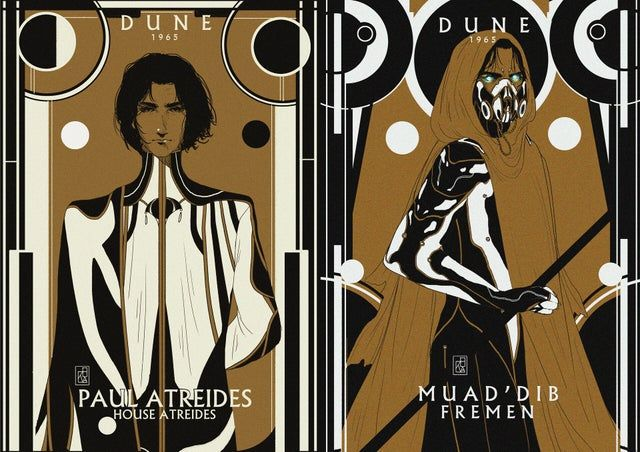

# Plataform Game: Plataformas de Duna
A atividade tinha como objetivo o desenvolvimento de um jogo de plataforma. Além das plataformas, conceitos como movimentação de câmeras deveriam ser utilizados para a imersão do jogador.

No caso do presente projeto, o jogo foi desenvolvido tendo em mente a temática da série de livros Duna, que tem como autor o escritor Frank Herbert. A temática foi usada apenas para propósitos de aprendizado e diversão pessoal. Todos os direitos originais da obra pertencem ao autor e às organizações responsáveis que possuem direitos autorais da série Duna.

Espero que esse pequeno trabalho possa ser considerado uma singela homenagem a Frank Herbert e sua tão grandiosa obra.

~ _Father, the sleeper has awakened!_ ~

# Objetivos das fases:
Todas as fases possuem 3 objetivos para serem concluídas, sendo eles:

1. Derrotar os inimigos Sardaukars.

2. Coletar a especiaria Mélange.

3. Obter a água da vida após o escudo que a protege ser removido ao cumprir os dois itens anteriores.

| **Inimigo Sardaukar** | **Especiaria Mélange** |
| --- | --- |
|  |  |

| **Escudo Bolha** | **Água da Vida** |
| --- | --- |
|  |  |

<!--

    <figure style="text-align: center; display: flex; flex-direction: column;">
        
        <figcaption>Inimigo Sardaukar</figcaption>
    </figure>
    <figure style="text-align: center; display: flex; flex-direction: column;">
        
        <figcaption>Especiaria Mélange</figcaption>
    </figure>
    <figure style="text-align: center; display: flex; flex-direction: column;">
        
        <figcaption>Escudo Bolha</figcaption>
    </figure>
    <figure style="text-align: center; display: flex; flex-direction: column;">
        
        <figcaption>Água da Vida</figcaption>
    </figure>

-->

# Fases do jogo:
O jogo possui dez fases, a estrutura geral é basicamente a mesma, porém, as plataformas e itens estão poscionados em locais diferentes e a quantidade e posição dos inimigos também mudam. Uma visão geral das fases pode ser vista nas imagens abaixo:

| **Fase 1** | **Fase 2** |
| --- | --- |
|  |  |

| **Fase 3** | **Fase 4** |
| --- | --- |
|  |  |

| **Fase 5** | **Fase 6** |
| --- | --- |
|  |  |

| **Fase 7** | **Fase 8** |
| --- | --- |
|  |  |

| **Fase 9** | **Fase 10** |
| --- | --- |
|  |  |

| **Menu do jogo** |
| --- |
|  |

# Sprites do jogo:
O jogo utilizou sprites _open source_ prontos, fornecidos gratuitamente no site [craftpix.net](https://craftpix.net/). A movimentação do personagem foi desenvolvida em partes utilizando um _controller_ de animação da _Unity_ e, em alguns detalhes, no código do _script_ que controla a movimentação do personagem, como pode ser visto nas imagens abaixo:

| **_Controller_ da animação** | **_Sprites_ livres** |
| --- | --- |
|  |  |

| **_Start_ do _PlayerControl.cs_** |
| --- |
|  |

| **_Script_ das colisões** |
| --- |
|  |

| **_Script_ da movimentação** |
| --- |
|  |

# Controle do jogo: 
O jogo possui _scripts_ para movimentação da câmera, que segue o movimento do personagem nas plataformas. Um _GameManager_ faz o controle central do jogo, enquanto um _ScoreManager_ cuida de maneira estática da pontuação geral das fases (a classe _static_ funcionou melhor que o padrão _singleton_ no caso do jogo). Existe uma classe para os atributos do personagem e classes para gerenciar a colisão com os itens, todas visíveis nas imagens abaixo:

| **_Script_ da câmera** |
| --- |
|  |

| **_Script_ do _GameManager_** |
| --- |
|  |
O _GameManage_ utiliza uma _HashTable_ para fazer o apontamento das fases  e _arrays_ para monitorar os inimigos.

| **_Start_ do _GameManager_** |
| --- |
|  |

| **Monitoramento dos inimigos** |
| --- |
|  |

| **_Update_ do _GameManager_** |
| --- |
|  |

| **Troca de cenas** |
| --- |
|  |

| **Controle dos finais** |
| --- |
|  |

| **Coleta da especiaria** |
| --- |
|  |

| **Classe estática** |
| --- |
|  |
A Classe seria um _ScoreManager_ , o seu nome foi alterado em referência  aos Fremen de Arrakis, e o atributo do _array_ em alusão ao Duque Leto.

| **Classe dos atributos** |
| --- |
|  |
A Classe de atributos teve o nome alterado em referência a Guilda Espacial,  e o atributo de vida em alusão a Lady Jéssica.

---

# Ya Hya Chouhada Muad'Dib!

---
